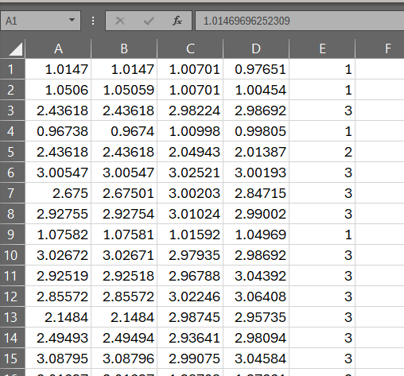
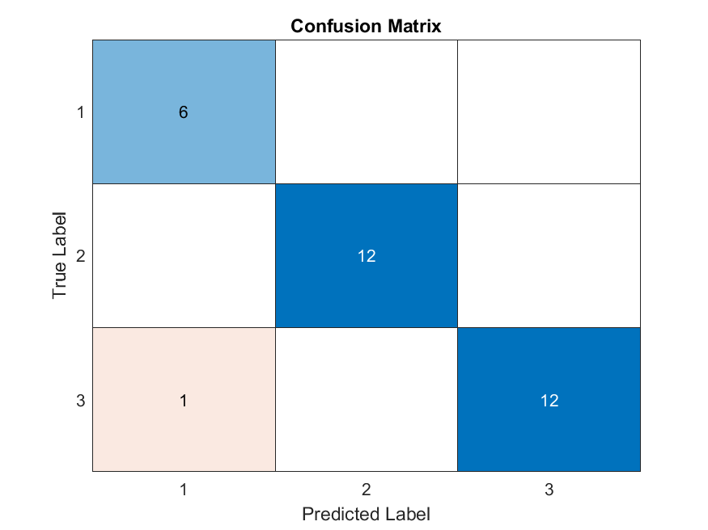

---
# Cascaded-ANFIS
Implementation of the Cascaded ANFIS using MATLAB environment.

## Table of Contents

- [Introduction](#introduction)
- [Installation](#installation)
- [Usage](#usage)
- [License](#license)

## Introduction

The Cascaded ANFIS is a novel architecture of the general ANFIS algorithm by Dr Jang (1993). This work is published under the title of "A Novel Optimization Algorithm: Cascaded Adaptive Neuro-Fuzzy Inference System" in the International Journal of Fuzzy Systems (2021).

This example Cascaded ANFIS model predicts the IRIS dataset using ten levels of cascades. The final training RMSE of this prediction is 0.000133332.

## Installation

clone the git and run the CascadedANFIS.m script in MATLAB.

## Code Explanation

### `CascadedANFIS.m`

#### Usage

This script implements a cascaded Adaptive Neuro-Fuzzy Inference System (ANFIS) for data processing and prediction. The script includes the following key components:

1. **Global Variables:** Set the parameters for the ANFIS model, such as the number of membership functions, type of membership function, maximum levels, and training epochs.

2. **Training:** Load the initial data and iteratively train ANFIS models at each cascade level. Pairing of input variables is done using a specified method (random pairing in this case). Trained models and pairing information are saved for testing.

   - The IRIS.csv dataset is initially stored in the 'Dataset' directory. The LoadData function loads and preprocesses data for training and testing the ANFIS model. 
   - The selected pairs are stored in the 'PAIRS' directory. For each input ( in IRIS case 4), a randomly selected input is paired and stored their indexes in the PAIRS directory as PAIRS_{level}_{input_index}.mat
   - The trained Fuzzy Inference Systems (FIS) are stored in the 'FIS' directory. Each pair at each level has its own FIS. Therefore, FISs are named as FIS_{level}_{input_index}.fis
   - Since the output of the previous level is taken as the input to the following level, the outputs of each pair ( in this case, 4 pairs) are stored in the 'Output/Train' directory. Here, each outputs are stored as Level_{level}.csv files.
   
   -- The CSV structure is as follows. 
   {Pair_1_output}, {Pair_2_output}, {Pair_3_output}, ... , {Pair_n_output}, {Actual output}

   
   
   This method helps to understand each level of training results by investigating each CSV file at the levels. 

4. **Testing:** Load test data and use the trained models to predict outputs. Outputs of each level are saved for the next level.
   - Here, previously split 'Dataset/test.csv' is used for testing.
   - Previously stored FIS and Pair information is collected for the prediction (at 'FIS/' and 'PAIRS/' respectively)
   - The outputs are stored as CSV files after each level in the 'Outputs/Test/' directory.
   
5. **Evaluate Results:** Calculate the average of the predicted outputs and compare them with the actual test targets. Calculate accuracy and generate a confusion matrix.
   - A confusion matrix is plotted and saved in the 'Results/' directory. 



#### Example

```matlab
% Example usage of CascadedANFIS
CascadedANFIS;
```

### `CreateANFIS.m`

#### Usage

This function creates an ANFIS model using the given input-output pairs and specified parameters.

#### Example

```matlab
% Example usage of CreateANFIS
input = [1 2; 3 4; 5 6];
outputs = [10; 20; 30];
mfType = "gaussmf";
mfNum = 3;
epoch = 100;
fis = CreateANFIS(input, outputs, mfType, mfNum, epoch);
```

### `LoadData.m`

#### Usage

This function loads and preprocesses data for training and testing the ANFIS model.

Here, three options are available.
1. Initial data preparing. (Split data to train and test Randomly (70% -30%) )
2. Load level output data as inputs (using only train set)
3. Load level output data as inputs (using only test set)
#### Example

```matlab
% Example usage of LoadData
name = 'Dataset/iris.csv';
opt = 1;
data = LoadData(name, opt);
```

## License

MIT License

Copyright (c) 2021 namalhappy

Permission is hereby granted, free of charge, to any person obtaining a copy
of this software and associated documentation files (the "Software"), to deal
in the Software without restriction, including without limitation the rights
to use, copy, modify, merge, publish, distribute, sublicense, and/or sell
copies of the Software, and to permit persons to whom the Software is
furnished to do so, subject to the following conditions:

The above copyright notice and this permission notice shall be included in all
copies or substantial portions of the Software.

THE SOFTWARE IS PROVIDED "AS IS", WITHOUT WARRANTY OF ANY KIND, EXPRESS OR
IMPLIED, INCLUDING BUT NOT LIMITED TO THE WARRANTIES OF MERCHANTABILITY,
FITNESS FOR A PARTICULAR PURPOSE AND NONINFRINGEMENT. IN NO EVENT SHALL THE
AUTHORS OR COPYRIGHT HOLDERS BE LIABLE FOR ANY CLAIM, DAMAGES OR OTHER
LIABILITY, WHETHER IN AN ACTION OF CONTRACT, TORT OR OTHERWISE, ARISING FROM,
OUT OF OR IN CONNECTION WITH THE SOFTWARE OR THE USE OR OTHER DEALINGS IN THE
SOFTWARE.

---

Feel free to customize this template to fit your project's specific needs.
